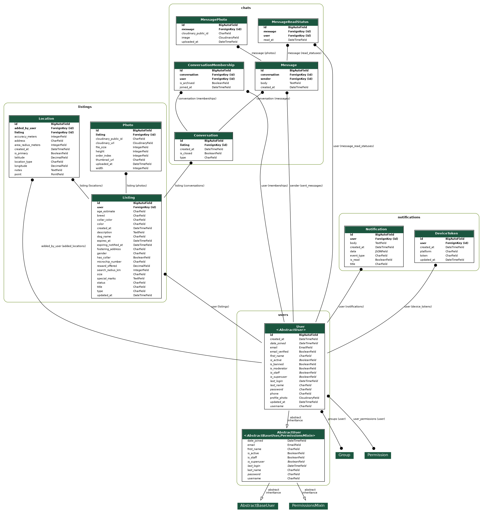
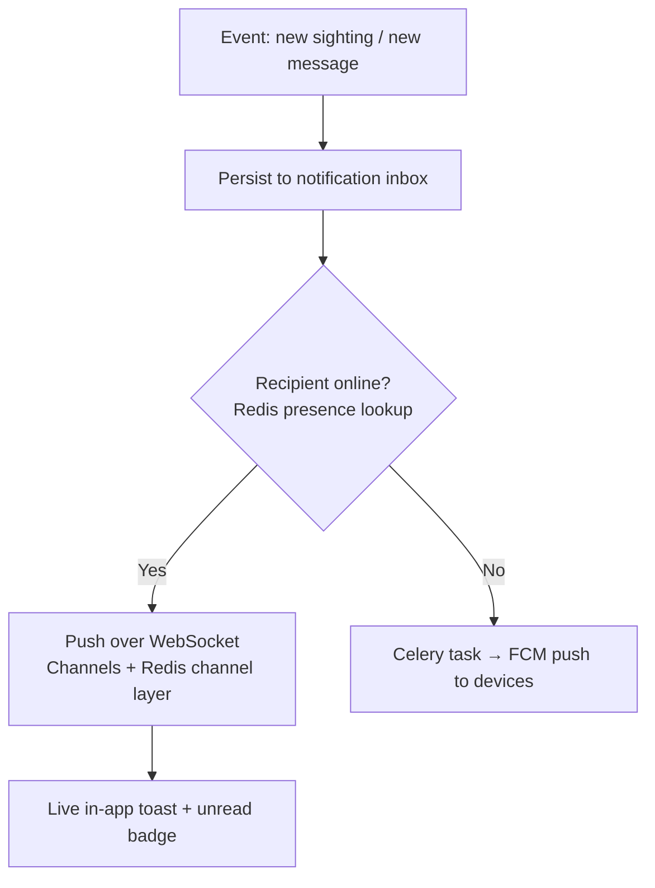
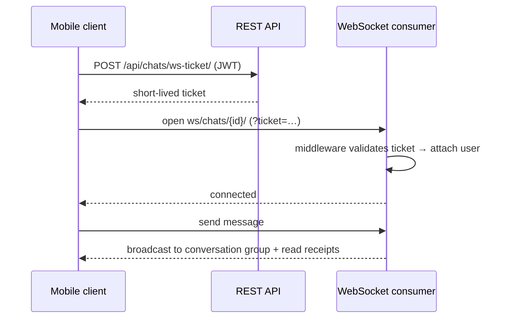

# Where Is My Dog?

A mobile platform that helps reunite lost dogs with their owners. It brings people who **lost** a dog and people who **found** one into one place — and, more broadly, aims to grow a local community that supports each other in the search: sharing sightings, updating locations, and staying in touch until every dog is home.

## Contents

1. [Demo](#1-demo)
2. [Live Backend](#2-live-backend)
3. [Tech Stack](#3-tech-stack)
4. [What's Built](#4-whats-built)
5. [How It Could Grow](#5-how-it-could-grow)
6. [Project Structure](#6-project-structure)
7. [Data Model](#7-data-model)
8. [How Notifications Work](#8-how-notifications-work)
9. [How Chat Works](#9-how-chat-works)
10. [Running Locally](#10-running-locally)
11. [Additional Documentation](#11-additional-documentation)

---

## 1. Demo

Three short screen recordings of the real app running on **iOS and Android**.

### 1.1 Reporting a lost dog · Android

Opening the app, filling in the multi-step form (photos, characteristics, location) and creating a listing, then a quick look at *Manage listing*.

<video src="https://github.com/user-attachments/assets/1df3f379-02a2-4ee7-9a3a-b9a5b7cc7aa3" width="300" controls></video>

### 1.2 Reuniting an owner with their finder · iOS + Android

Left = iOS (owner), right = Android (finder). The owner filters by breed, finds their dog, checks the listing's location, and messages the finder. The finder — who took the dog home to foster it — gets a **push notification**, opens the conversation, and asks for verification. The owner sends a photo of the same dog and reads out what's on the collar; the finder confirms and shares the address.

<video src="https://github.com/user-attachments/assets/32ad42ee-a960-4e05-b5f4-e213a3e8c8a5" controls></video>

### 1.3 Collaborative location updates · Android + iOS

Left = Android, right = iOS. A user adds a **new location to an existing listing** instead of creating a duplicate. The listing owner, with the app open, receives a **real-time in-app notification** and sees the freshly added sighting on the map.

This is the foundation for the "suggest similar listings before you create a new one" idea (see [How It Could Grow](#5-how-it-could-grow)).

<video src="https://github.com/user-attachments/assets/871d4a64-0a13-4aba-bade-bf52fce2bb8a" controls></video>

---

## 2. Live Backend

The API is deployed on Render (free tier):

- **Base URL:** https://wimd-backend.onrender.com
- **Interactive API docs (Swagger):** https://wimd-backend.onrender.com/api/docs/

> ⚠️ Free tier sleeps when idle — the **first request can take ~30–60s** to cold-start. Just retry once and it responds normally.

---

## 3. Tech Stack

**Backend**
- Python · Django + Django REST Framework
- Django Channels + Daphne (ASGI) — WebSocket chat & notifications
- Celery + Redis — async tasks (listing expiration, notifications)
- PostgreSQL + PostGIS — geospatial queries
- JWT authentication (SimpleJWT)
- drf-spectacular — OpenAPI schema & Swagger UI

**Mobile**
- React Native (Expo) + TypeScript
- Expo Router
- NativeWind (Tailwind) · React Native Maps

**Infrastructure**
- Docker / Docker Compose (full local stack)
- Render — web service (Docker), managed PostgreSQL, Redis
- Cloudinary — photo storage & transformation
- Firebase Cloud Messaging — push notifications

> **Note on the deployment:** the Render free tier runs a single Docker web service, so Celery runs in **eager mode** (`CELERY_TASK_ALWAYS_EAGER`) — there is no separate worker/beat process in production. The full asynchronous setup (worker + beat) is defined and runs locally via `docker-compose`.

---

## 4. What's Built

**Mobile**
- JWT auth with secure token storage
- Browse lost/found listings — paginated, multi-select filters (breed, characteristics)
- Listing detail with card navigation and a map of the location history
- Multi-step create-listing form (photos, location, characteristics)
- Edit / delete / mark-resolved on your own listings
- Expiry badge with an urgent state and one-tap bump to renew
- Profile with active and closed listings; settings (profile update, password change, account deletion)
- In-app chat — 1:1 and group, photo messages, live updates
- Real-time in-app notifications over WebSocket (live toast + unread badges), both platforms
- Push notifications when the app is backgrounded/closed — **Android only** (no Apple Developer account for iOS push); device-token registration + tap deep-linking
- Persisted notification inbox with mark-as-read / mark-all-read
- Report and browse listing locations on the map
- Skeleton loaders, pull-to-refresh

**Backend**
- REST API (Django + DRF) with JWT auth and owner/permission checks on every mutating endpoint
- Listings CRUD with Cloudinary photo upload
- PostGIS-based location support and location history
- Multi-select filtering
- Listing expiration + expiring-soon warnings via Celery; owner-only bump endpoint to renew
- In-app chat: REST + WebSocket consumer with ticket-based auth and read receipts
- Notifications: WebSocket when the user is online, FCM push when offline; device-token registration, unread-count endpoint, persisted inbox
- OpenAPI schema + Swagger UI
- Test suite across all apps — REST endpoints, models, WebSocket consumers, Celery tasks, push and ticket auth; CI (GitHub Actions) runs flake8 + the tests on every push and PR

---

## 5. How It Could Grow

Natural extensions that were scoped out of the MVP:

- **Smart duplicate detection at creation time** — when someone starts a "found dog" listing, compare location + characteristics + timing against existing ones and suggest *"is this the same dog? add a sighting instead"*. The collaborative-location feature (demo 1.3) is already the second half of this flow — it just needs the matching step in front of it.
- **iOS push notifications** — the whole pipeline exists; it only needs an Apple Developer account and APNs credentials.
- **A true production deployment** — a dedicated Celery worker + beat process (instead of eager mode) so expiration and notifications run on schedule under load.
- **Matching notifications** — alert owners automatically when a new "found" listing matches their lost dog's characteristics and area.
- **Trust & moderation** — email verification, a user-reporting system, and moderator tooling (remove listings, block users, review reports).
- **Community & engagement** — a loyalty-points/ranking system for people who help reunite dogs, turning one-off reunions into a lasting local support network.

---

## 6. Project Structure

**Backend** — Django project with five apps. Only the architecturally notable files are highlighted:

```
backend/
├── config/            # Settings, ASGI entrypoint, root URLs, Celery app
├── users/             # Auth & account management (JWT, email backend, settings)
├── listings/          # Core domain: lost/found listings, photos, locations (PostGIS)
│   ├── filters.py     #   multi-select breed / characteristic filtering
│   └── tasks.py       #   Celery: expiration + expiring-soon warnings
├── chats/             # 1:1 & group chat
│   ├── consumers.py   #   WebSocket consumer — live messages, read receipts
│   ├── middleware.py  #   ticket-based WebSocket auth
│   └── tickets.py     #   short-lived WS auth tickets
├── notifications/     # Cross-cutting notifications
│   ├── presence.py    #   online/offline presence tracking
│   ├── dispatch.py    #   route each notification to WebSocket or push
│   ├── push.py        #   FCM delivery
│   └── models.py      #   persisted inbox + device tokens
└── manage.py
```

Every app follows the same layout — `models.py`, `serializers/`, `views/`, `permissions.py`, `urls.py` and a `tests/` suite; the tree above only calls out the noteworthy files.

**Mobile** — Expo Router app (file-based routing), React Context for state:

```
mobile/
├── app/                  # Expo Router — screens = files
│   ├── (auth)/           #   login, register
│   ├── (tabs)/           #   home, chats, create, profile
│   ├── listing/[id]/     #   detail, edit, map, add-new-location
│   ├── chat/[id].tsx     #   conversation screen
│   └── settings/         #   username, phone, password, delete account
├── contexts/             # AuthContext, ListingContext, LocationContext,
│                         #   NotificationContext (WS), PushContext (FCM)
├── components/           # Reusable UI
├── utils/                # API client & helpers
├── types/                # Shared TypeScript types
└── constants/
```

---

## 7. Data Model



Django models and their relationships, generated from the models with [django-extensions](https://django-extensions.readthedocs.io/).

---

## 8. How Notifications Work

Every notification (a new sighting on your listing, a new message) goes through a single entry point that **always persists it to the inbox first**, then decides *how* to deliver it based on whether the recipient is currently connected.

Presence is tracked in **Redis**: each open WebSocket connection registers its channel under a per-user key with a short TTL, refreshed by a heartbeat — so *"is this user online?"* is one Redis lookup. If they're online, the notification is pushed live over the WebSocket (through the Channels channel layer, also backed by Redis) as an in-app toast. If not, a **Celery** task sends it as an FCM push to their registered devices.



---

## 9. How Chat Works

Chat runs over WebSockets (Django Channels + Daphne). Since a WebSocket handshake can't carry an `Authorization` header the way a normal request does, the client first exchanges its JWT for a **short-lived ticket** over REST, then opens the socket with that ticket. Middleware validates it and attaches the user to the connection.



Once connected, messages (including photos) are broadcast live to everyone in the conversation group via the Redis channel layer, with read receipts tracked per participant. The full WebSocket API is specified in [docs/asyncapi.yaml](docs/asyncapi.yaml) (AsyncAPI 3.1.0).

---

## 10. Running Locally

### Backend

The full stack (API, WebSockets, Postgres/PostGIS, Redis, Celery worker + beat) runs with Docker Compose:

```bash
docker-compose up --build
```

- API: http://localhost:8000
- Swagger UI: http://localhost:8000/api/docs/

Copy `backend/.env.example` to `backend/.env` and fill in the credentials (Django secret, Cloudinary, FCM, etc.).

### Mobile

The app lives in [mobile/](mobile/) and uses Expo. Copy `mobile/.env.example` to `mobile/.env` and point it at your local or the live backend.

```bash
cd mobile
npm install

# Quick start in Expo Go (JS only — no native push):
npx expo start

# Native dev build (required for FCM push) — generates android/ios and installs on a device/emulator:
npx expo run:android
npx expo run:ios
```

> **Push notifications need your own Firebase project.** The backend reads a service-account key (`FIREBASE_CREDENTIALS_FILE`), and the app needs the matching `google-services.json` (Android). Push also requires a native dev build (`expo run:*`) — it doesn't work in Expo Go — and iOS additionally needs an Apple Developer account. Everything else runs without any of this.

---

## 11. Additional Documentation

- [WebSocket API (AsyncAPI)](docs/asyncapi.yaml) — full real-time chat & notifications API (AsyncAPI 3.1.0)
- [User stories](docs/user-stories.md) — the user scenarios planned for the app's development, across finder, owner, moderator and system actors

---

## License

Licensed under [CC BY-NC 4.0](https://creativecommons.org/licenses/by-nc/4.0/) — free for non-commercial use, learning, and viewing. Commercial use is not permitted.

---

## Author

**Sebastian Cybul** — GitHub: [@sebastiancybul](https://github.com/sebastiancybul)
